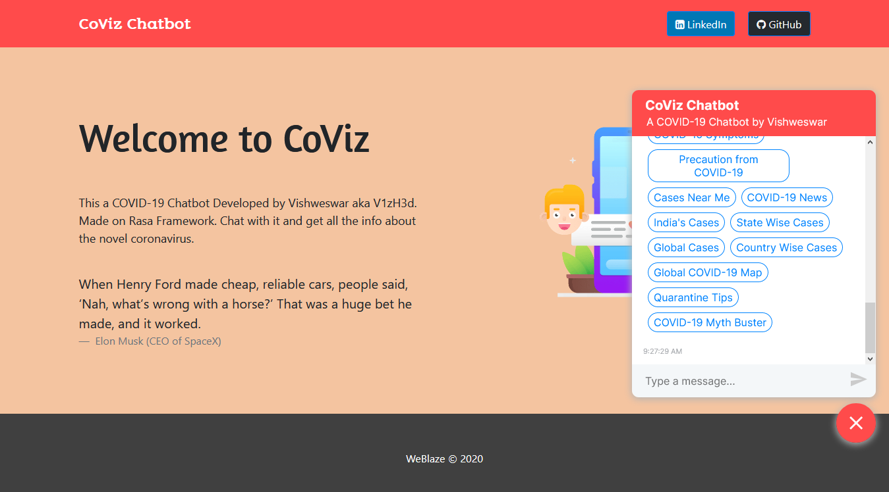

# CoViz-Chatbot-Rasa
This is a COVID-19 Chatbot built with Rasa Framework which provides all vital information regarding novel coronavirus.

Steps needed to run this project:
1. You need to install docker first. To download just visit this [website](https://www.docker.com/products/docker-desktop) (***Note:*** *Docker cannot be installed on Windows 10 Home*) 
2. In your project directory just open command prompt or terminal and type this command:

```docker-compose up --build```

3. After running all the container by the above command just open your browser and type:

```http://localhost:3000```

4. Your project is up and running



**NOTE:** You need to add your credentials in config.ini (inside actions directory) and endpoints.yml (inside backend directory)
